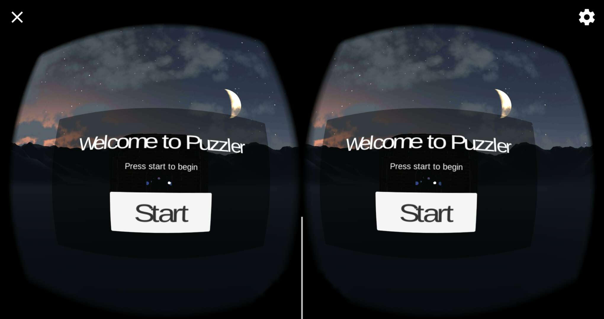
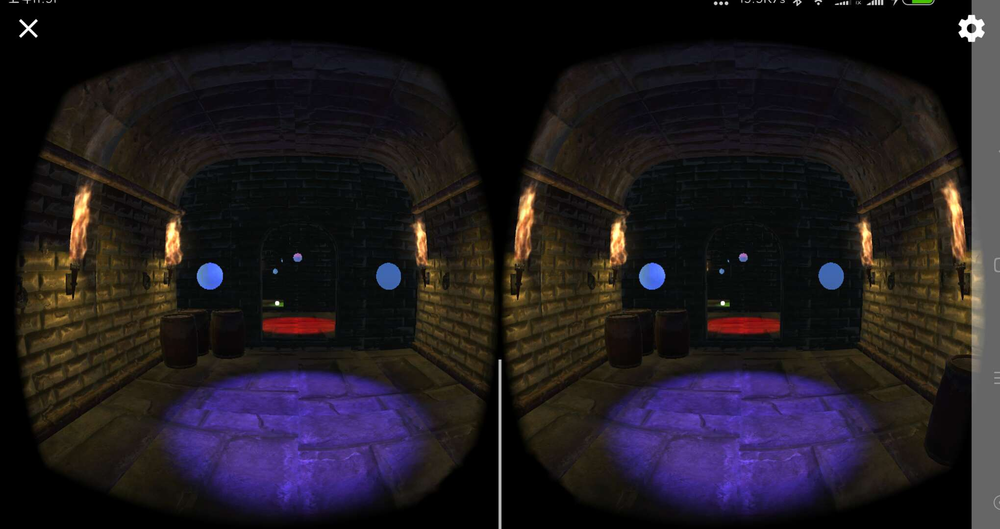
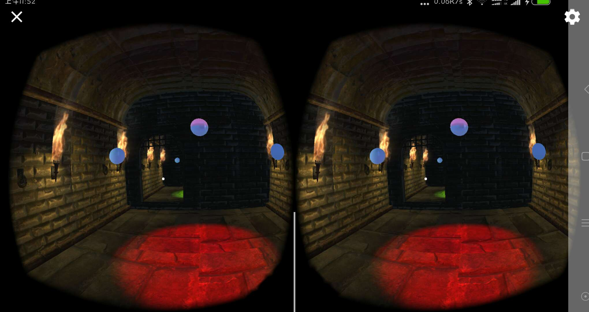
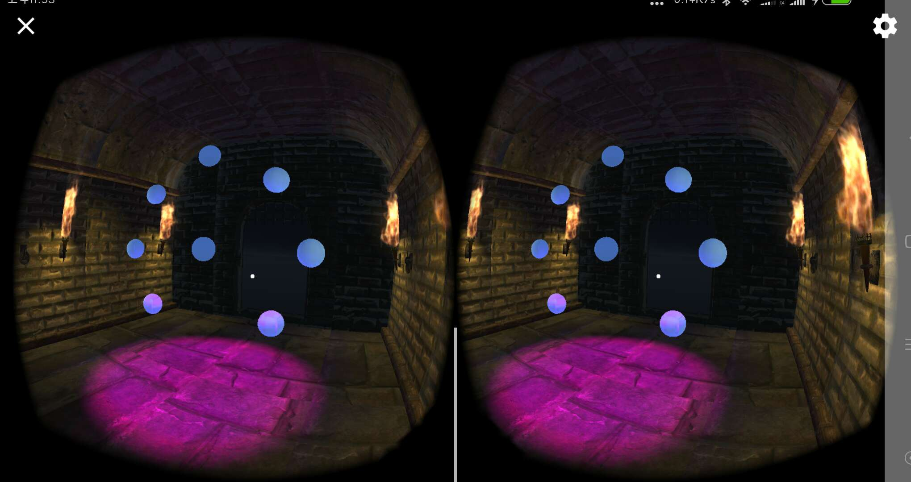
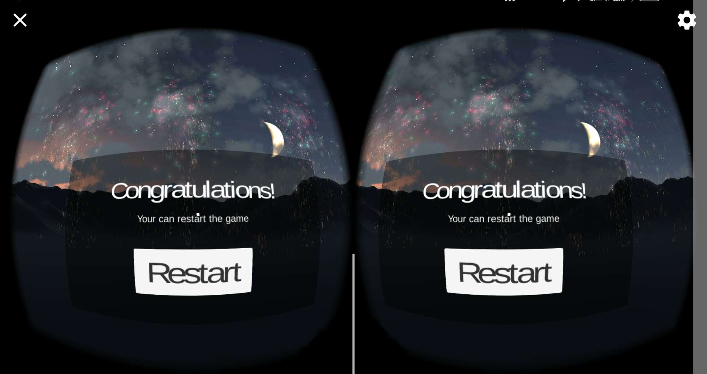
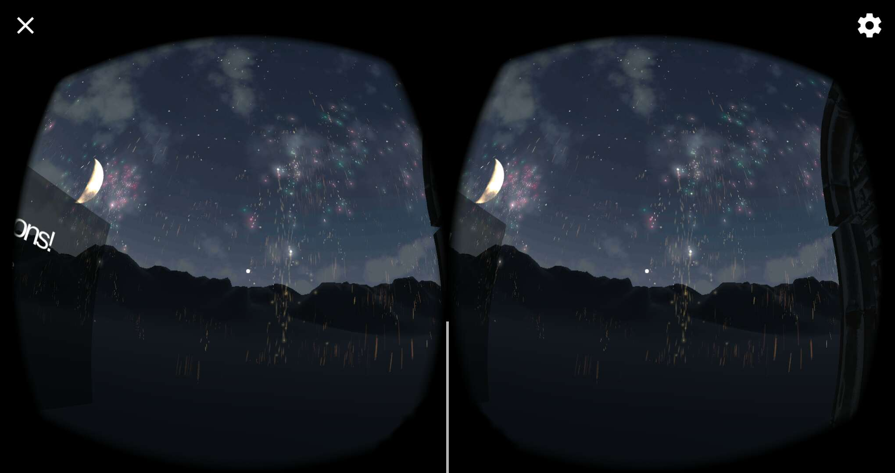
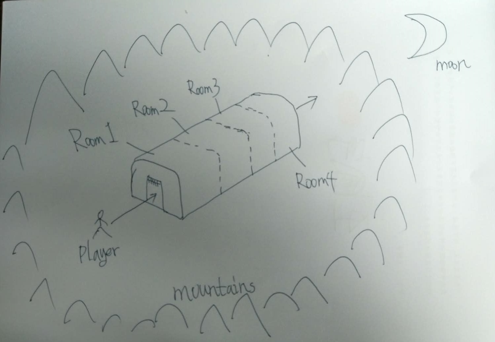
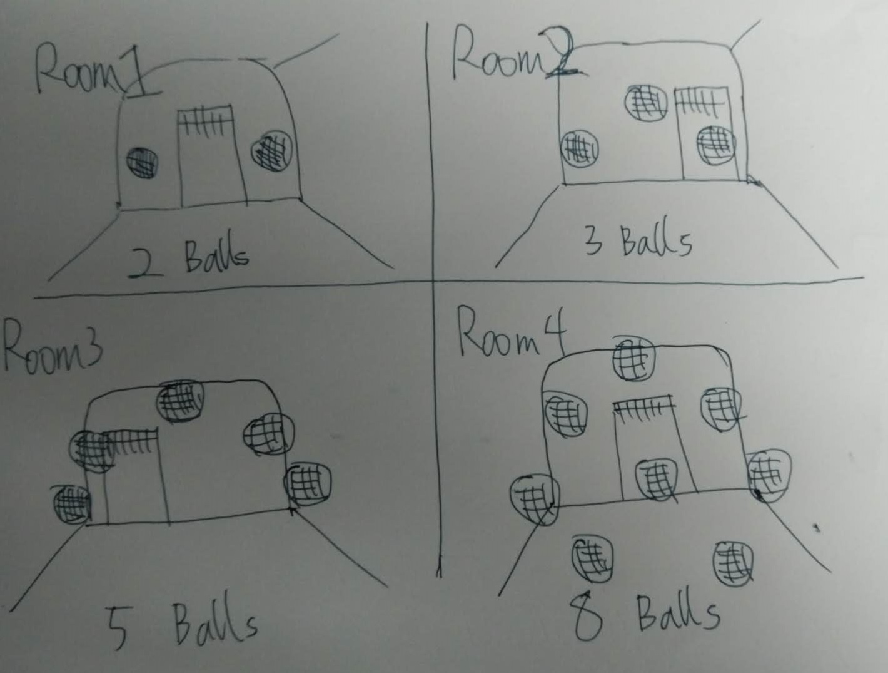
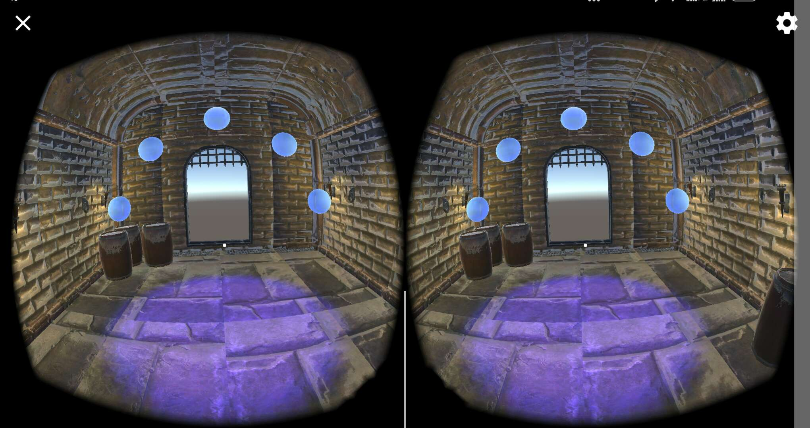

**Elnino Wang**

VR Designer, MobileGame developer

# Puzzler VR 

## Outline

This is a puzzler project with magic ambience. In this game, you will be invited to a dungeon, which is full of medieval and magical atmosphere. Without addressing the puzzler, you won’t be able to get out. The puzzler is simple. There will be 4 rooms in the dungeon, and each room has a puzzler with lighted up in certain sequence after you getting in. What you have to do is to remember the sequence, and redo it. Sounds as hints will help you to address it. I hope the player enjoys this puzzler.

## Outcomes

### video

<iframe width="560" height="315" src="https://www.youtube.com/embed/p6QYhq-UZLw" frameborder="0" allowfullscreen></iframe>

The process of the game is this, the first is to start the interface, click "Start", into the dungeon, first into the first room, the first room has 2 balls. Click in the correct order to enter the second room, the second room has 3 balls. Click in the correct order to enter the third room, the third room has 5 balls. Click in the correct order, enter the fourth room, the fourth room has eight balls, click in the correct order, out of the dungeon. This see the sky, this is if you click "Restart", the game will start over.

### Screenshots

Start of the game:

Room 1 -- 2 balls:

Room 2 -- 3 balls:

Room 3 -- 5 balls:

Room 4 -- 8 balls:

After the player passes through all the rooms in turn, the game wins.

Game clearance victory:

Game after the victory of the fireworks launch effect:

## Story of the process

## Statement of Purpose
Puzzler Project is a mobile VR experience for new VR users, which is a variation of ”Simon says” game.

### Persona
-- "I like to immerse myself in another world"

Jack is just a new college student, a movie lover who loves to experience immersion. He gradually loves virtual reality and related technologies. Jack likes to play VR puzzle games and get a strong immersive experience. In addition, Jack hopes to join the VR / AR industry later. However, he has no virtual reality experience， but he has enough computer knowledge.

### Sketch

The whole game involves scenario sketches

4 rooms game ball design

## User Testing outcomes and iteration

### User test 1:
1. How do you describe your environment?

"I feel very comfortable and very well.I heard different environmental sounds in the open valley under the beautiful moonlight.I saw a dungeon invisible.It was an artifact that pushed me into the dungeon.I Heard a very eerily controlled voice, surrounded by four torches that did not glow, and saw two blue balls suspended in the air "

2. Can you describe your feelings at the scene?

"I think the room is too small"

3. Do you see everything clearly?

"Can see everything"

### User test 2:
1. How do you describe your environment?

"Feeling a very empty environment, I saw a room, a few balls drifting inside, and I walked into the room. The room was weird, the sound was terrible, but the environment did not feel horrible at all.

2. Can you describe your feelings at the scene?

"I feel like I'm really younger than me."

3. Do you see everything clearly?

"Yes, I see very clearly."

### Result:

1. There is no fire on the torch of the room, but the light is very strange, to increase the torch
2. The room is too bright, to be dimmed
3. The room is too small to zoom in to feel a real room size.

Here is a picture of a previous version:

This is the latest version of the picture:

It can be seen that there has been a lot of improvement in the shaping of environmental effects:

## Conclusion

Much of the game's framework has been completed and succeeded in creating a medieval and magical atmosphere. In this game, players can learn how to get started, and if the solve puzzles go into the next room until the final clearance, this is a great opportunity to personally enter a new world.
When developing the game, I devoted a lot of time to stabilizing the movement, making the light intensity appropriate and ensuring that no objects were very close to people.

## Next Steps

1. Make the game more complicated and confused with diverse.
2. Improve the style of exercise to create a different experience.
3. Make the environment more beautiful and beautiful, not so monotonous
